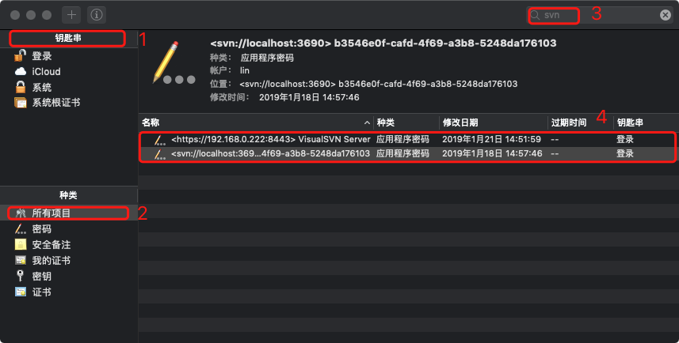
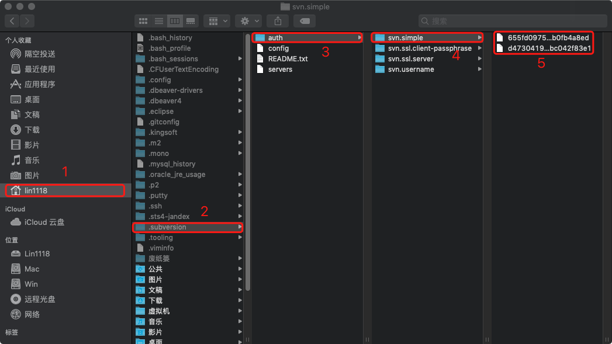
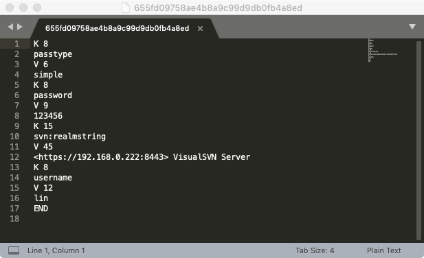
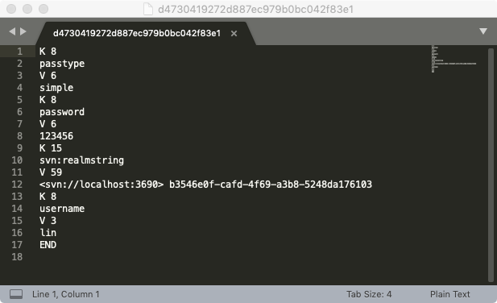

# MacOS系统下Eclipse插件Subclipse不能记住密码的问题解决

> 这个问题困扰了我一天，百度了好久都没有解决，最后灵光一闪轻松解决，哈哈

### 一、首先得让“钥匙串访问”里面有SVN的记录

钥匙串访问里面记录了SVN的地址、用户名、密码等信息，只要在“终端”里执行svn命令检出一个文件，系统就会自动生成一条记录，如何执行命令请参考[这里](https://www.cnblogs.com/lxwphp/p/9109685.html)，最好只检出一个文件，如果文件较多会花很多时间。我没有验证这一步是不是必须的，最好是有这一步操作。

我这里有两条记录，第一条连接的是局域网内使用VisualSVN搭建的SVN服务器，第二条连接的是本机搭建的SVN服务器。

### 二、再次在Eclipse里面尝试一次记住密码

### 三、修改配置文件（关键）

经过第一步后其实就生成了这些配置文件，经过第二步后配置文件会有一点变化。

请参考下图修改你的配置文件，只参考我的配置，你原有的配置能不改就不要改动。

上面是VisualSVN搭建的服务器生成的配置文件，用户名和密码请修改成你自己的。

上面是MacOS本机搭建的服务器生成的配置文件，用户名和密码请修改成你自己的。

### 四、重启Eclipse再试试看

### 五、总结

我是如何解决的：先用CentOS连接SVN，然后参考其生成的配置文件。
